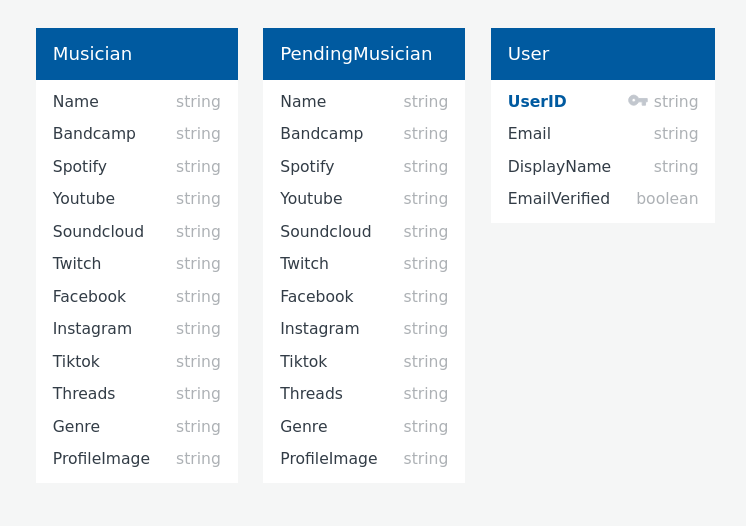

# Tulsa Musician Directory: Design Documents

## 1. Writeups of the design

### 1.1 What are you going to build and how does it fit the theme?

We are building the "Tulsa Musician Directory", a web application that provides a centralized platform for showcasing local musicians with audio content, music links, and social media handles. This platform fits the theme of 'outside' by providing a tool for Tulsans who want to get out of the house and listen to live music. It also fits the theme of 'outside' by providing a platform for local musicians to get their music out to the public.

### 1.2 What tools will you use?

Frontend: ReactJS for building the user interface, along with React Router for navigation.
Backend: Firebase Firestore for database storage and Firebase Storage for storing musician images and related media.
Styling: CSS modules for component-specific styling.
Authentication: Firebase Authentication for user registration and login.
Version Control: Git and GitHub for source code management and collaboration.

### 1.3 How long do you expect to spend on the development of each part?

Frontend Development: 5 days
Set up React environment: 0.5 days
Develop individual components: 3 days
Integrate components and finalize UI: 1.5 days

Backend Development: 3 days
Set up Firebase and integrate with React: 1 day
Implement database CRUD operations: 1 day
Implement authentication and authorization: 1 day

Styling and Responsiveness: 2 days
Style individual components: 1 day
Ensure responsiveness and cross-browser compatibility: 1 day

Testing and Debugging: 2 days
Unit testing of components: 1 day
Integration testing and bug fixing: 1 day

Total Estimated Development Time: 12 days

## Firebase Firestore Operations Documentation

Collections

- musicians: Stores all musician profiles.
- users: Stores registered users and their roles (if any).

Operations on musicians Collection

- Fetch all musician profiles
  Method:
  `getDocs(collection(db, 'musicians'))`
- Fetch a specific musician's profile by name
  Method:
  `doc(collection(db, 'musicians'), musicianName)`
  Usage: Use this to retrieve a specific musician's data based on their name.
- Add a new musician profile
  Method:
  `setDoc(doc(collection(db, 'musicians')), musicianData)`
- Update a specific musician's profile
  Method:
  `updateDoc(doc(collection(db, 'musicians'), musicianName), updatedData)`
- Delete a specific musician's profile
  Method:
  `deleteDoc(doc(collection(db, 'musicians'), musicianName))`

Firebase Authentication Operations

- Register a new user
  Method:
  Firebase Authentication's `createUserWithEmailAndPassword(email, password)`
- Log in an existing user
  Method:
  Firebase Authentication's `signInWithEmailAndPassword(email, password)`
- Log out the current user
  Method:
  Firebase Authentication's `signOut()`

## UML Diagram

## The Inspiration Behind the Tulsa Musician Directory

When I think about the vibrant music scene in Tulsa, it always amazes me how many talented artists go unnoticed. This thought was the spark that ignited the idea for the Tulsa Musician Directory - a platform that gives every musician a chance to shine.

### Discovering Data Sources

The journey began with hunting for the right data. We were fortunate to find a trove of information about local artists in various databases and online platforms. These data sources were invaluable in populating our directory and ensuring it was comprehensive and up-to-date.

### Choosing the Right Tools

Next came the decision of which tools to use. We settled on Firebase for our backend, given its scalability and user-friendly interface. React, with its component-based architecture, was the obvious choice for our frontend, making it easier to manage and update the musician profiles.

### Database Design

Our database design was crucial to ensure smooth and efficient data retrieval. We used two collections: musicians for approved profiles and pendingMusicians for those awaiting approval. This separation ensured a clean workflow and minimized conflicts. Here's our database design in UML format.

### Challenges Faced and Overcome

Like any project, we had our fair share of challenges. The most significant was ensuring the smooth transition of profiles from pendingMusicians to musicians. Initially, we faced duplication issues, but with rigorous testing and some tweaks in our logic, we overcame this hurdle.

### A Glimpse of the Platform

The Tulsa Musician Directory is a visual treat, designed keeping both musicians and visitors in mind. Here are some screenshots of our platform. And if you're curious to explore it yourself, here's the link. For testing purposes, you can use the following credentials: Username: testUser | Password: testPassword123.

### In Conclusion

Building the Tulsa Musician Directory has been a journey of learning, collaboration, and immense satisfaction. It's a testament to what can be achieved when you combine passion with the right tools and a dedicated team.

Remember, every city has its unique rhythm, and through this platform, we hope to showcase Tulsa's to the world.

## Todos

- !!! recreate credentials
- dont push the new ones to git

- Logout functionality
- email verification for user profile creation
- Image resizing
- filetype verification for image upload
- firestore backup
- edit suggestion button on artist page
- ability for users to add images to musician document???
